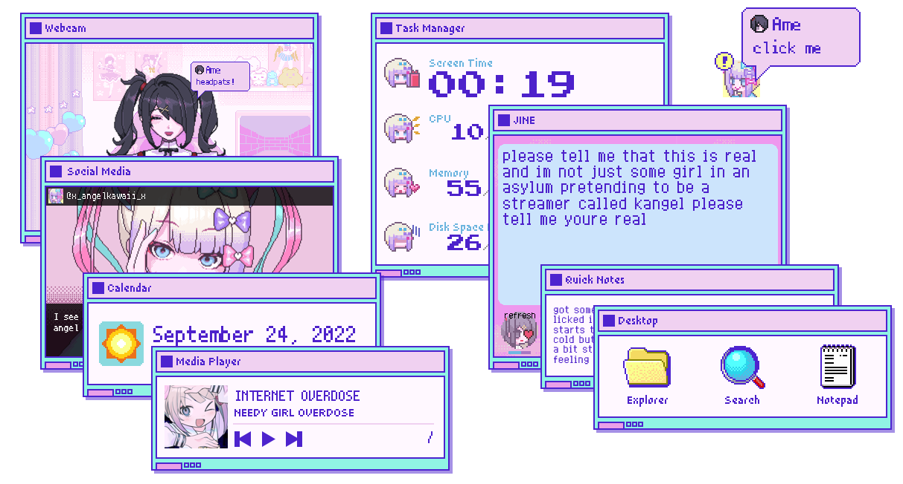

# Needy Streamer Overload Rainmeter Skins
Rainmeter Skins inspired by the visual novel, [NEEDY STREAMER OVERLOAD](https://store.steampowered.com/app/1451940/NEEDY_STREAMER_OVERLOAD/) (also known as NEEDY GIRL OVERDOSE).

# Skins
- [Task Manager](#task-manager)
- [Ame](#ame)
- [JINE](#jine)
- [Social Media](#social-media)
- [Media Player](#media-player)
- [Calendar](#calendar)
    - [Weather Installation](#weather-installation)
- [Desktop Icons](#desktop-icons)
- [Quick Notes](#quick-notes)
- [Trash Bin](#trash-bin)

# Rainmeter Installation
To get the skin, you need to install Rainmeter. Go to this [page](https://www.rainmeter.net/) for installation.

Once done, you can download the `.rmskin` file on the [Releases](https://github.com/lezzthanthree/Needy-Streamer-Overload/releases).

# Features
## Task Manager
Task Manager shows information about your computer performance (Uptime, CPU, RAM, and Disk Space). It is heavily inspired by the Task Manager from the game.  

Values also turn red when reaching the critical zone, so don't overwork your PC!

- Drive on the Disk Space portion can be changed on the `.ini` file.

## Ame
Ame-chan is on your desktop now, and she wants headpats from you!

She will change depending on your computer's performance. She'll be stressed out as you stress your CPU too, so be cautious!

- Background also changes when reaching a number of Screen Time hours.
- You can do activities with her like playing a game or watching a movie!
- Stats are also customizable on Settings.

## JINE
JINE is a messaging app from the game. Ame will send you random messages, so please respond her with stickers!

- You can add and customize the messages inside the [`script`](JINE/scripts/) folder.
- Skin only shows four stickers, but can be customized what emojis to show on Settings.
- You can also change how frequent Ame will send you messages on Settings.

## Social Media
Pictures from KAngel and Ame from the game, now on your desktop!

- The likes and retweets update in real time according to your screen time!
- You can add your own tweets inside the [`script`](Social%20Media/scripts/) folder and pictures inside the [@Resources](@Resources/Images/Social%20Media/Tweets/) folder.
- You can also change the size of the window on Settings.

## Media Player
Media Player shows what you are listening. Redesigned by YumeMiya#4040!

Available Players:
* Spotify
* iTunes
* MusicBee
* WebPlayer (needs browser extension to work)

## Calendar
Calendar shows the current time and date, together with the weather.

Weather Information must be added by the user. Follow the [Weather Installation](#weather-installation) below.

### Weather Installation

(Please wait for an hour or so to activate your API key.)

<!---
1. Go to openweathermap.org.
2. Search for your city.
3. Copy the ID on the address bar.
4. Register an account.
5. Go to "My API Key" once finished registering.
6. Copy your Default API key.
7. Open the Calendar skin folder by right clicking the skin and selecting the first option.
8. Open `settings.inc`.
9. Paste your ID and API key there.
--->

## Desktop Icons
A recreation of the desktop icons from the game. Pixel Icons! Now, you won't get bored with these.

- You can add your own icons by simply copy and pasting one folder and editing the `.ini` file.
- Icons are available inside the [@Resources](@Resources/Images/Desktop%20Icons/) folder.

## Quick Notes
Want something to be reminded of?

- This skin contains four variants!
- You can also change the title according to your likeness.

## Trash Bin
Trash Bin is just the Recycling Bin that looks like a Magic Paper.

Hovering will show the size and the number of items inside the Trash Bin.

# Warning
It may look cute, but the skin still contains dialogues that depicts self-harm, drugs, and sexual references. Any incidents happen will not be held responsible by the creator of this skin, so make sure you do NOT try any of the more extreme or depressing actions at home.

# Credits
- Frostworth#0529 from the NSO [Discord Server](https://discord.com/invite/JNGgNCX6Ue) for the JINE chats!
- u/spuddddddddddddddddd for their [Ame Sprite Table](https://redd.it/urvi1x).
- [Persona 5 Calendar Rainmeter Skin](https://github.com/Mive82/Persona-5-Calendar) for the OpenWeatherMap API Code.
- YumeMiya#4040 for redesigning the Media Player and creating icons on certain skins!
---

