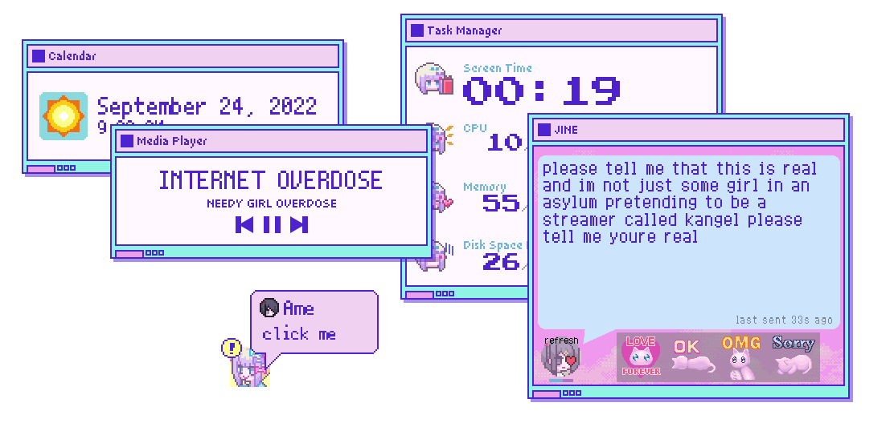
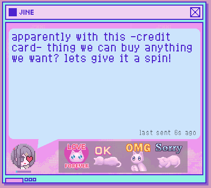
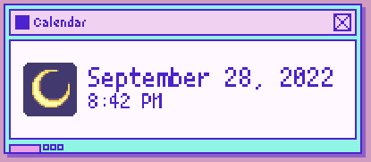

# Needy Streamer Overload
Rainmeter Skins inspired by the visual novel, Needy Streamer Overload.

## Skins
|Name|Skin|
|-|-|
|Task Manager||
|JINE|
|Media Player|
|Calendar||
|Recycle Bin|

## Features
- Task Manager shows information about your computer performance (Uptime, CPU, RAM, and Disk Space). It is heavily inspired by the Task Manager from the game. 

- JINE is a messaging app from the game. Ame will send you random messages so please respond her with stickers!
  - You can add and customize the messages inside the `script` folder.
- Media Player shows what you are listening on **Spotify**.
- Calendar shows the current time and date.
  - Will be planning to make weather icons soon!
- Recycle Bin will give you enough dosage of Magic Paper...

## Credits
- NSO [Discord Server](https://discord.com/invite/JNGgNCX6Ue) for the JINE chats!