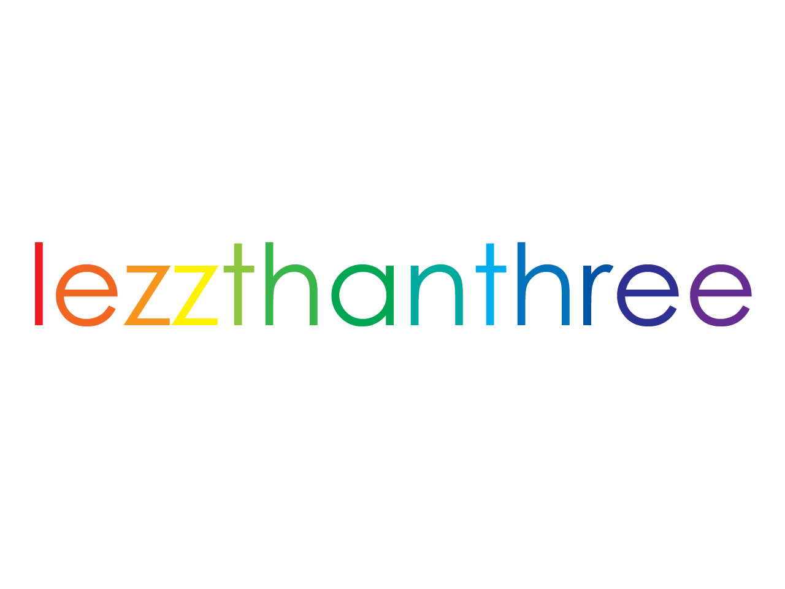

# Needy Streamer Overload
Rainmeter Skins inspired by the visual novel, [Needy Streamer Overload](https://store.steampowered.com/app/1451940/NEEDY_STREAMER_OVERLOAD/).

## Skins
|Name|Skin|
|-|-|
|Task Manager||
|JINE|
|Media Player|
|Calendar||
|Recycle Bin|

## Features
- Task Manager shows information about your computer performance (Uptime, CPU, RAM, and Disk Space). It is heavily inspired by the Task Manager from the game.  

  - Drive on the Disk Space portion can be changed on the `.ini` file.
- JINE is a messaging app from the game. Ame will send you random messages, so please respond her with stickers!
  - You can add and customize the messages inside the `script` folder.
  - Skin only shows four stickers, but can be customized what emojis to show on the `.ini` file.
  - You can also change how frequent Ame will send you messages.
- Media Player shows what you are listening on **Spotify**.
  - Current Bug: Play/Pause Button.
- Calendar shows the current time and date.
  - Will be planning to make weather icons soon!
- Recycle Bin will give you enough dosage of Magic Paper...
  - Right click to see what's inside... is it junk?
- 

## Warning
It may look cute, but the skin still contains dialogues that depicts self-harm, drugs, and sexual references. Any incidents happen will not be held responsible by the creator of this skin, so make sure you do NOT try any of the more extreme or depressing actions at home.

## Credits
- NSO [Discord Server](https://discord.com/invite/JNGgNCX6Ue) for the JINE chats!

---

